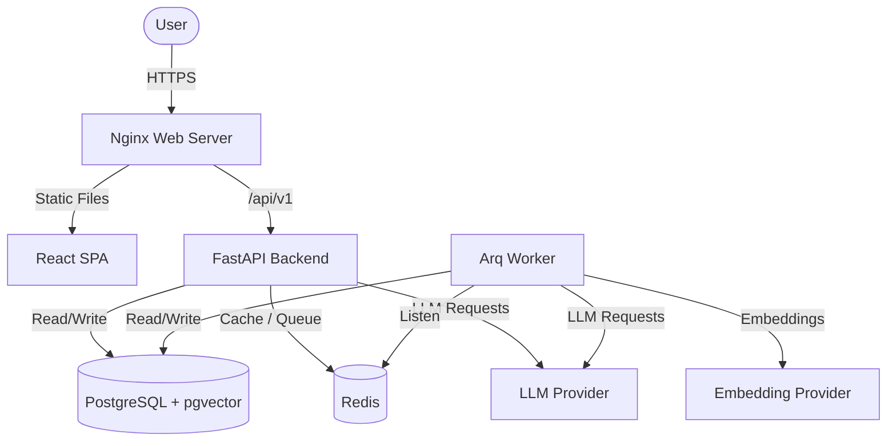
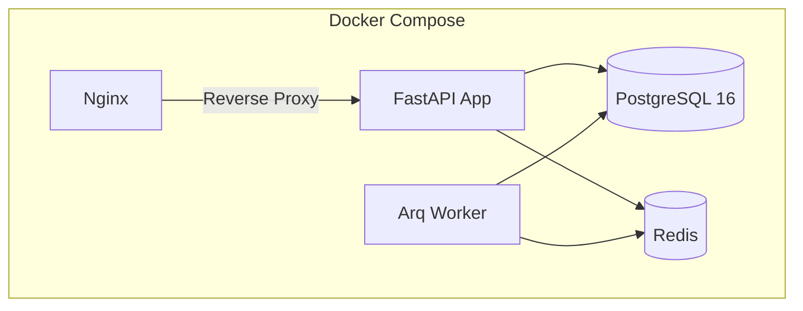
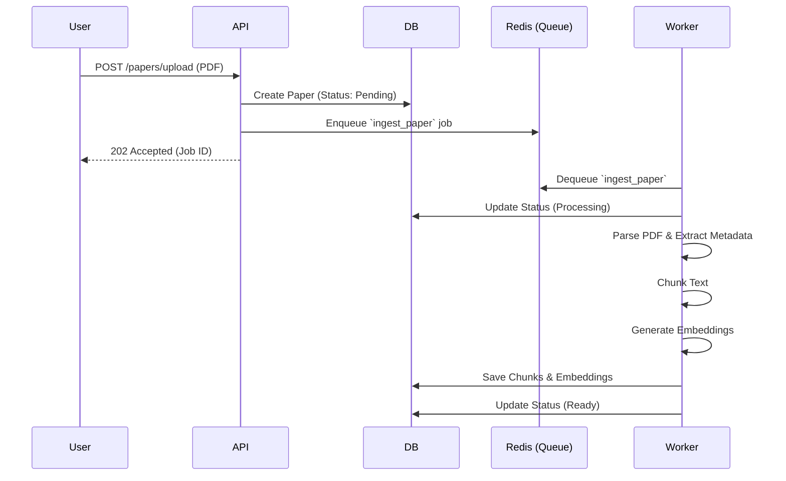
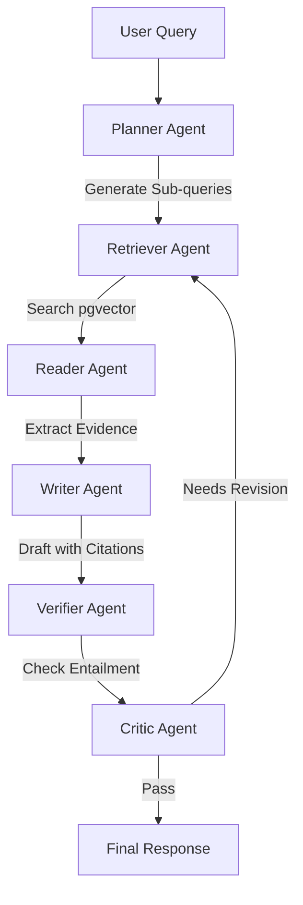

# Architecture Design

## System Context Diagram

## Container Diagram

## Request Flow (PDF Ingestion)

## Agent Graph Workflow

## Deployment Architecture
- **Single-Host Docker Compose**: Runs Nginx, API, Worker, PostgreSQL, and Redis.
- **Scale-Out Path**: The API and Worker are stateless. Nginx acts as a load balancer for multiple API replicas. PostgreSQL and Redis can be moved to managed services (e.g., RDS, ElastiCache) for production scale.
